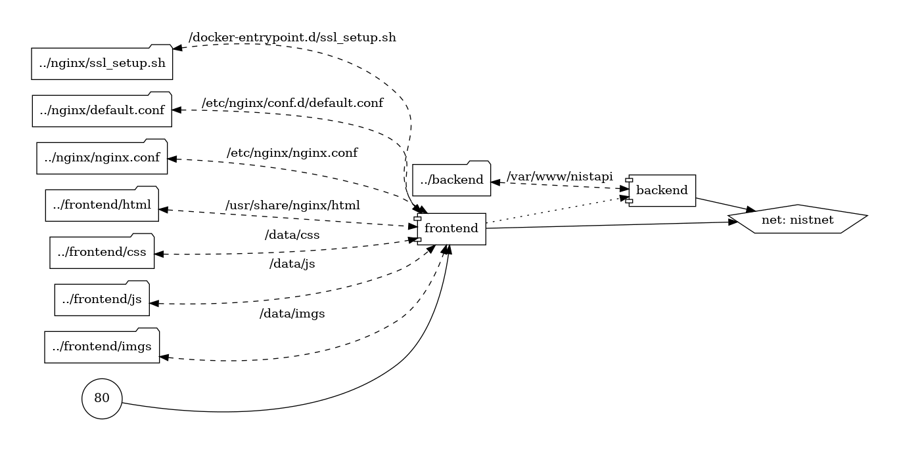

# Configurações dos containers com docker-compose

Dois containers backend e frontend na mesma rede chamada nistnet

# Backend

Imagem node versão 14.11.0-alpine

Uma variável de ambiente chamada HOST_IP para definição de requisições autorizadas

Sem portas expostas

Escutando na porta 8090

# Frontend

Imagem nginx versão 1.19.2-alpine

Volumes:

- docker-entrypoint.d configuração do ssl
- nginx.conf configuração do nginx 
- default.conf configuração do servidor
- mapeamento das pastas dos arquivos html, css, js e imgs

Porta exposta 80:80

# Chart 
